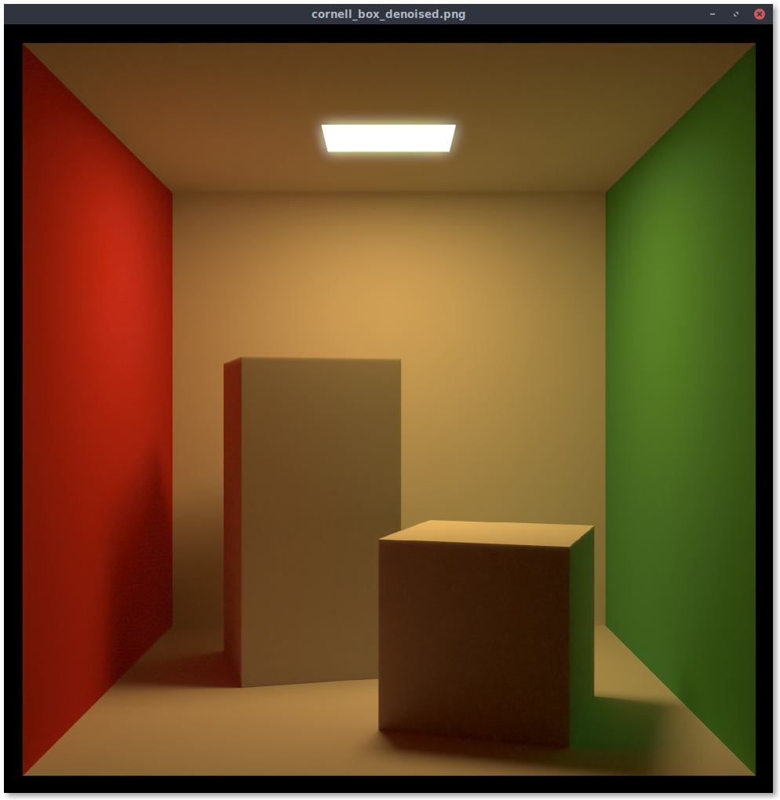

  

viewimg is an image viewer intended to be used with OpenEXR and Radiance HDR images, however
other popular image formats are supported as well. The goal of viewimg is to be a cross-platform
image viewer that quickly opens OpenEXR and Radiance HDR images with the purpose of instantly
seeing the image contents. There is no editing component to this application,
therefore tone mapping and other HDR editing operators are not supported.
The typical use case of viewimg would be to view HDR images immediately after rendering.

For both OpenEXR and Radiance HDR images, the f32 values are clamped between 0.0 and 1.0
before casting to u8. In the case of OpenEXR images, gamma correction of 2.0 is also applied.

Installation
============

To install viewimg run `cargo install viewimg` in a terminal prompt.

Note: Vulkan must be installed on the target system in order for viewimg to work correctly.
For Debian users this can be done with the command `sudo apt install mesa-vulkan-drivers`.

Usage
=====

To use viewimg you can run `viewimg` in a terminal with the path to the
image file that you wish to open:

    $  viewimg ../cornell_box_denoised.hdr

Screenshot
==========

